## Description

**pymplot** is a lightweight Python plotting package for generating high-quality figures from multi-dimensional scalar data. It provides a command-line interface (CLI) for rapid visualization without writing custom plot scripts, while supporting fine-grained control over every visual element.

This work is under LANL open-source approval reference C20105.

## Reference

Please refer to the [paper draft](doc/paper.pdf) for details.

## Installation

Install from the repo root:

```bash
pip install -e .
```

This installs the `pymplot` Python package and registers all CLI tools (`x_showmatrix`, `x_showcontour`, etc.) as system commands. The dependencies (`numpy`, `scipy`, `matplotlib`, `pyvista`) are installed automatically.

## Documentation

Run any command without arguments (e.g. `x_showmatrix`) to print the full argument reference.

## Function API

In addition to the CLI, all tools are available as Python functions via `src/api.py`:

```python
from pymplot import showmatrix, showcontour, showslice, showwiggle, showvolume, showgraph
```

Each function accepts a NumPy array as its first argument and the same keyword arguments as the CLI flags:

```python
import numpy as np
from pymplot import showmatrix, showcontour, showslice

data2d = np.random.rand(80, 120).astype('float32')
data3d = np.random.rand(40, 50, 30).astype('float32')

showmatrix(data2d, colormap='jet', legend=True, outfile='matrix.pdf')
showcontour(data2d, overlay=True, outfile='contour.pdf')
showslice(data3d, slice1=20, slice2=25, slice3=15, outfile='slices.pdf')
```

Functions also accept an `ax=` argument for embedding plots into an existing matplotlib figure — enabling multi-panel layouts without temporary files:

```python
import matplotlib.pyplot as plt
from pymplot import showmatrix, showcontour, showwiggle, showvolume

fig, axes = plt.subplots(2, 2, figsize=(12, 9))
showmatrix(data2d, colormap='seismic', legend=True, ax=axes[0, 0])
showcontour(data2d, overlay=True,                  ax=axes[0, 1])
showwiggle(data2d[:, :30], fill=True,              ax=axes[1, 0])
showvolume(data3d,                                 ax=axes[1, 1])
plt.tight_layout()
plt.savefig('panel.pdf')
```

See [example/test_api.py](example/test_api.py) for a full worked example.

---

## Main Features

### 2D Matrix / Image Plot — `x_showmatrix`
Displays a 2D array as a color image.
- Any matplotlib colormap plus custom colormaps (e.g. `rainbow256`, `coldwarm`)
- Multiple font families: Arial, Helvetica, Times, Courier, Consolas, IBM Plex
- Flexible tick labels — per-tick custom strings, multi-line, LaTeX math
- Colorbar with configurable position, tick spacing, log/linear scale
- Annotations: text, arrows, polygons, circles, all with full style control

### 2D Contour Plot — `x_showcontour`
Overlays contour lines (and optionally filled contours) on a scalar field.
- Automatic or manually specified contour levels; log-scale contours
- Optional background image overlay
- Contour label placement with font and color control
- Irregular domain support via axis origin/spacing options

### Wiggle Trace Plot — `x_showwiggle`
Seismic-style wiggle traces with optional filled amplitude shading.
- Multiple overlaid datasets with independent color and width
- Horizontal or vertical trace orientation
- Gaussian-interpolated background image option

### 1D Graph / Scatter Plot — `x_showgraph`
Creates line, scatter, and bubble plots for 1D or tabular data.
- Multiple datasets in one figure; selectable columns
- Log axis, axis closure, marker styles
- Arrows, text annotations, polygons
- Bubble size scaling by a third variable

### 3D Cavalier Projection — `x_showvolume`
Renders a 3D volume as a cavalier projection (an oblique parallel projection).
- Four octant orientations (`--+`, `---`, `-+-`, `-++`)
- Interior slice planes exposed by cutting a corner out of the volume
- Configurable view angles, colormap, colorbar, all axis tick/label options
- **3D interactive mode** (`--render 3d`): solid volume rendered with PyVista, corner clipped to expose interior, camera auto-oriented to face the cut

### 3D Volume Contour Plot — `x_showvolcon`
Cavalier projection with 3D contour surfaces on the slice planes.
- Filled or line contours; log-scale option
- Same octant and angle controls as `x_showvolume`

### 3D Orthogonal Slice Plot — `x_showslice`
Three orthogonal cross-sections displayed together.
- 2D panel layout or 3D perspective view (`--render 3d`)
- Configurable slice positions along each axis

### 3D Slice + Contour Overlay — `x_showslicon`
Combines `x_showslice` imagery with contour lines on the same slice planes.

---

## Examples

All examples can be reproduced with [example/test.rb](example/test.rb).

### 2D matrix — Marmousi velocity model (multiple colormaps and fonts)

<table>
<tr>
<td align="center">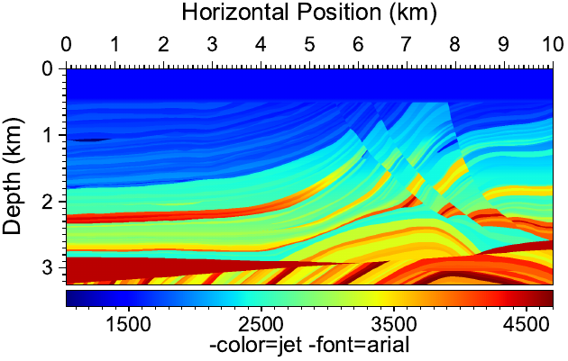<br><sub>jet / Arial</sub></td>
<td align="center">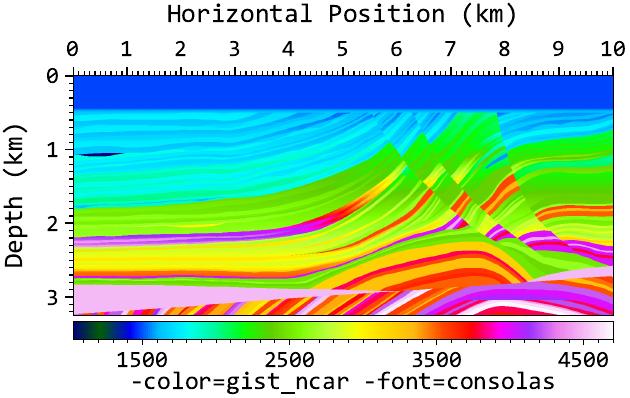<br><sub>gist_ncar / Consolas</sub></td>
<td align="center">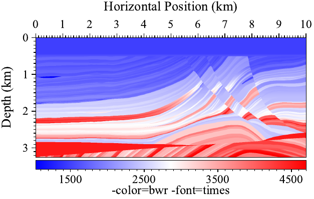<br><sub>bwr / Times</sub></td>
</tr>
<tr>
<td align="center">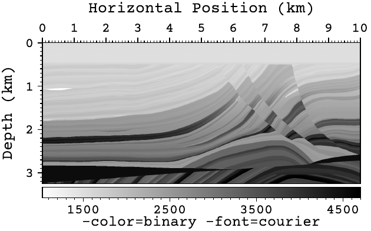<br><sub>binary / Courier</sub></td>
<td align="center">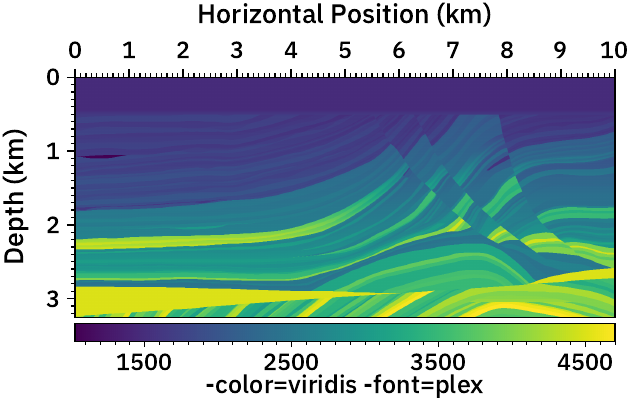<br><sub>viridis / Plex</sub></td>
<td align="center">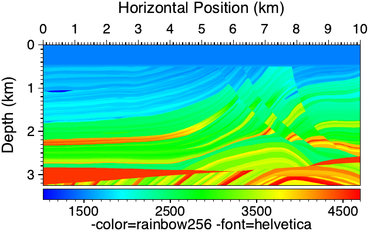<br><sub>rainbow256 / Helvetica</sub></td>
</tr>
</table>

### 2D matrix — BP velocity model with annotations

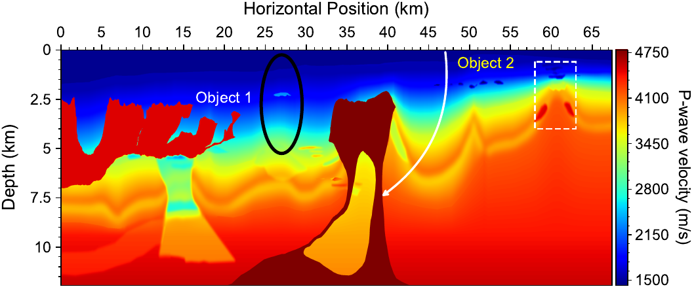

### 2D matrix — flexible tick labels

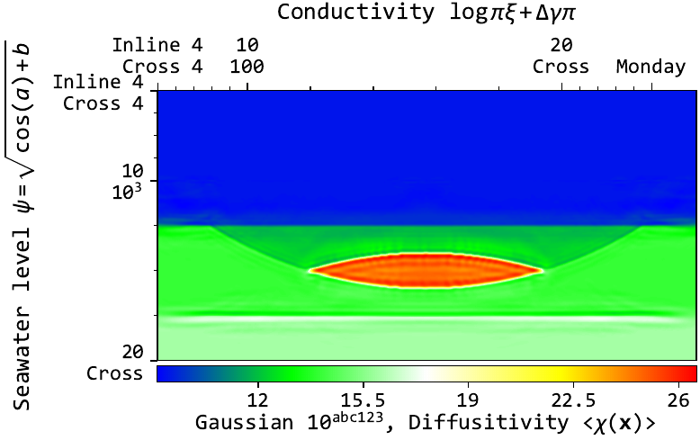

### Wiggle trace plots

<table>
<tr>
<td align="center">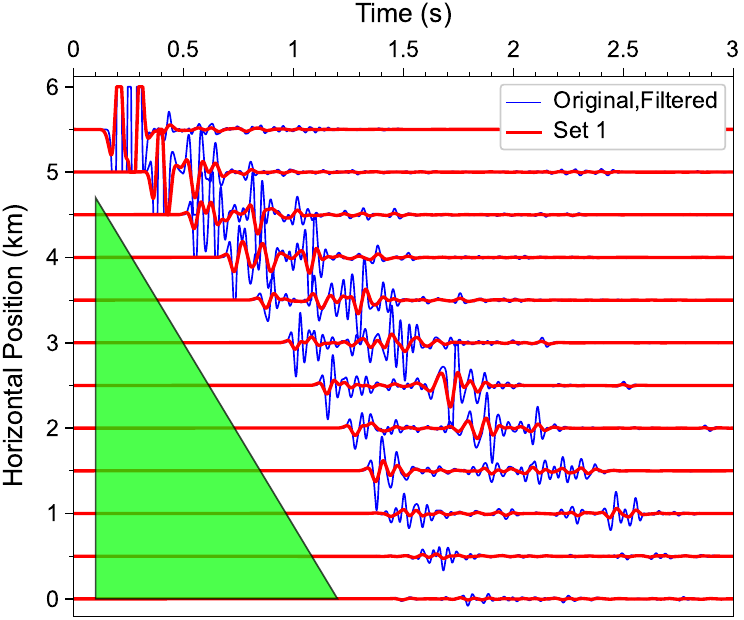<br><sub>Horizontal, two datasets</sub></td>
<td align="center">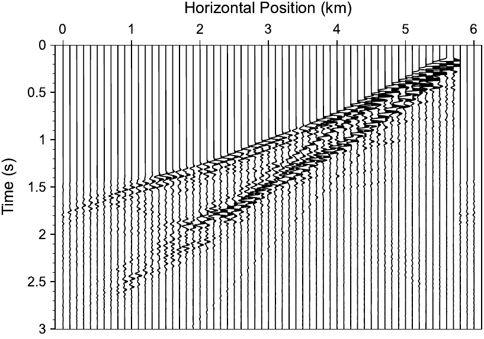<br><sub>Vertical, filled</sub></td>
<td align="center">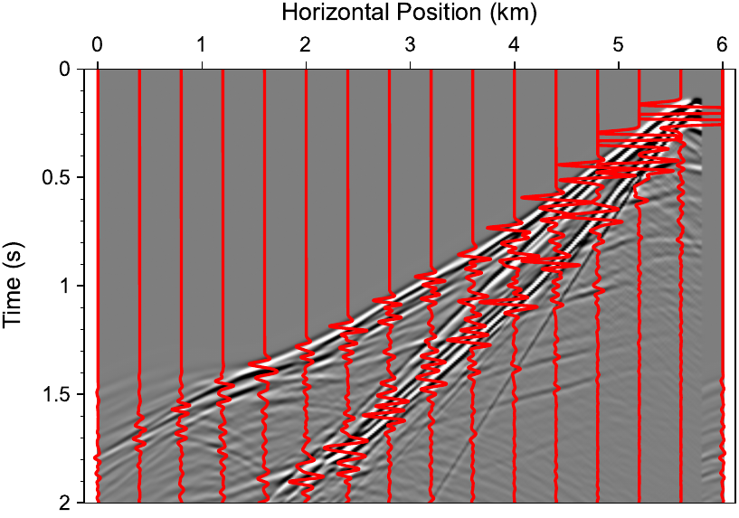<br><sub>Vertical, image background</sub></td>
</tr>
</table>

### 1D graph / scatter plots

<table>
<tr>
<td align="center">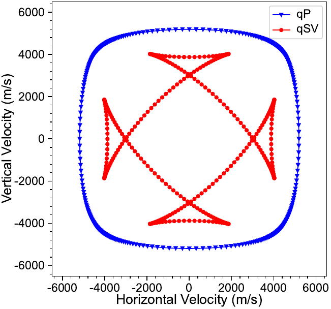<br><sub>Phase velocity diagram</sub></td>
<td align="center">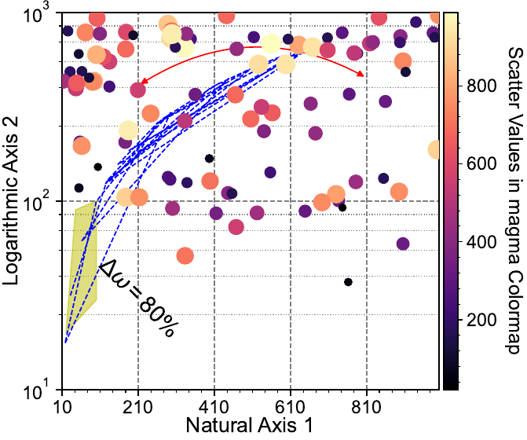<br><sub>Scatter / bubble with annotations</sub></td>
</tr>
</table>

### 2D contour plots

<table>
<tr>
<td align="center">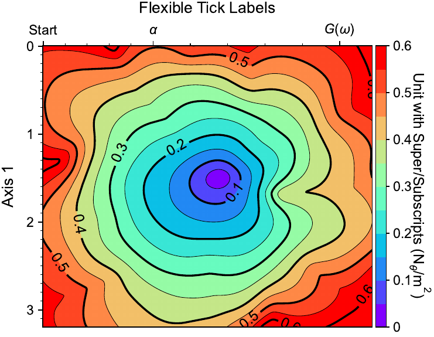<br><sub>Traveltime with image overlay</sub></td>
<td align="center">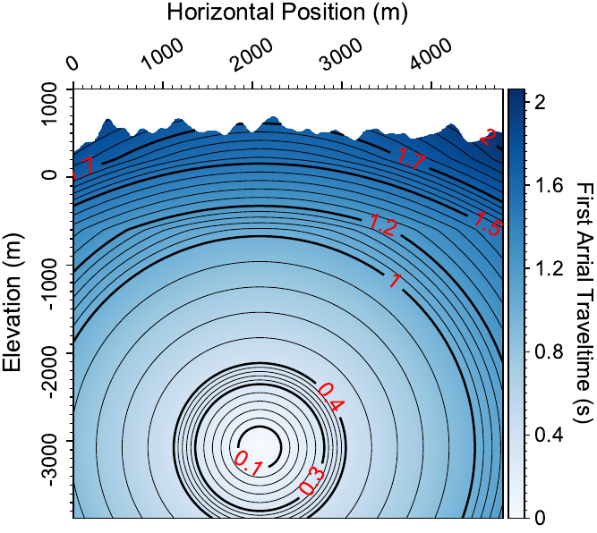<br><sub>Traveltime on irregular topography</sub></td>
</tr>
</table>

### 3D volume cavalier projection and contours

<table>
<tr>
<td align="center">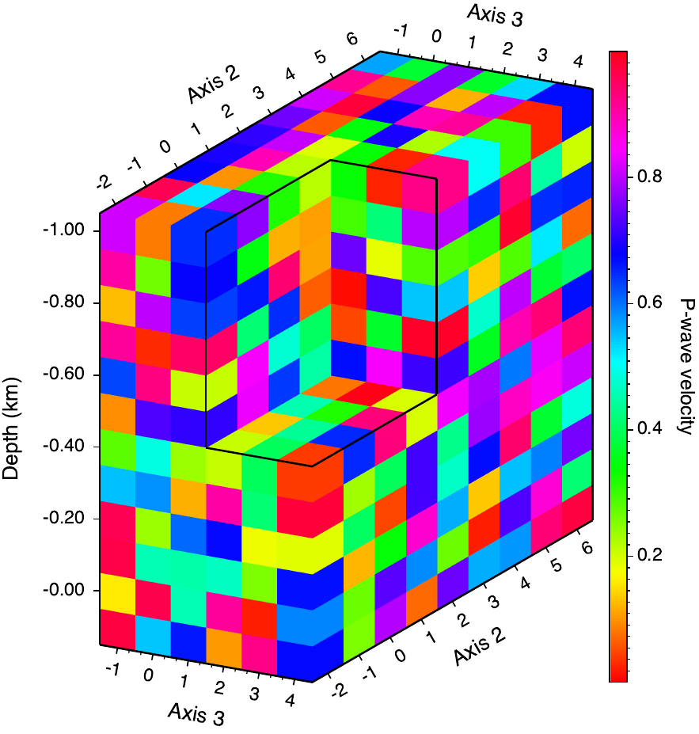<br><sub>Cavalier projection</sub></td>
<td align="center">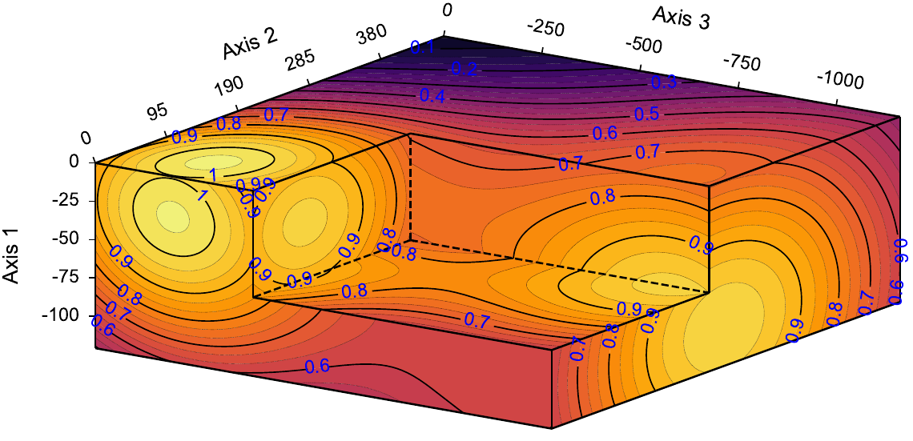<br><sub>Volume contours (linear)</sub></td>
<td align="center">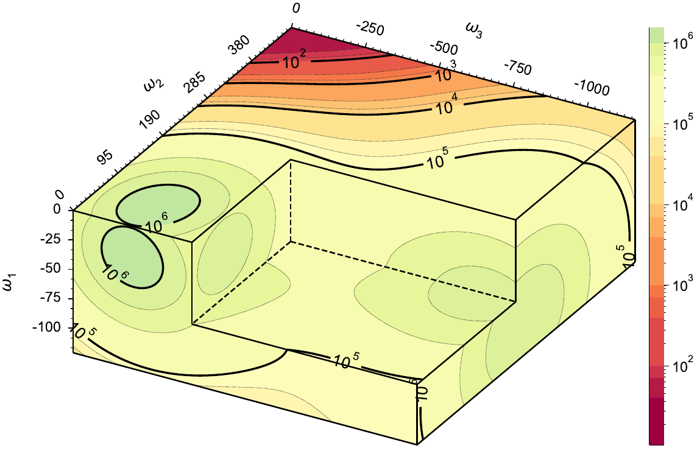<br><sub>Volume contours (log)</sub></td>
</tr>
</table>

### 3D volume PyVista render

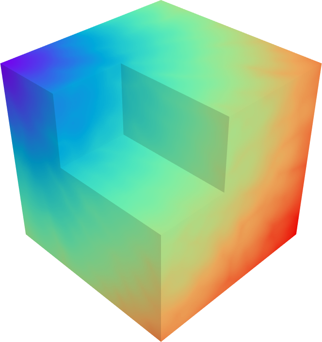

### 3D orthogonal slice plots

<table>
<tr>
<td align="center">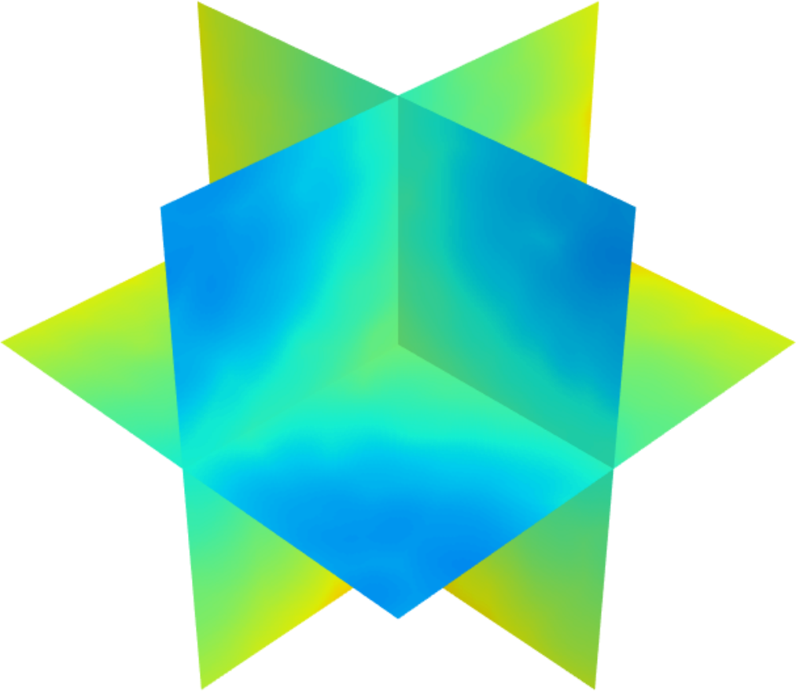<br><sub>Three orthogonal slices (3D view)</sub></td>
<td align="center">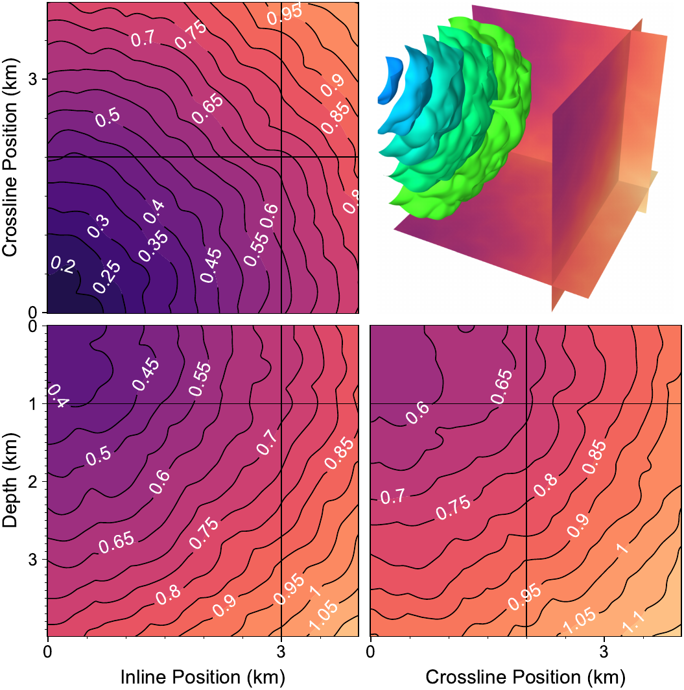<br><sub>Slices with contour overlay</sub></td>
</tr>
</table>

---

## License

`pymplot` is distributed under the BSD License. See [LICENSE](LICENSE) for details.

## Author

Kai Gao, <kaigao@lanl.gov>

Feedback, bug reports, and improvement ideas are welcome.

If you use this package in your research, please cite it as:
> Kai Gao, Lianjie Huang, 2020, Pymplot: An open-source, lightweight plotting package based on Python and matplotlib, URL: [github.com/lanl/pymplot](https://github.com/lanl/pymplot)
